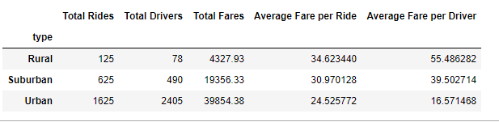

# PyBer Analysis

## Overview
The purpose of this analysis is to create a DataFrame of the ride-sharing data by city type. The end result is to create a multiple-line gaph that shows the total week fares for each city type by using Pandas and Matplotlib. This analysis will summarie how the data differs by city type and how these differences can be used by decision-makers at PyBer.

## Results
To begin the analysis, the two following files were used:
- ride_data.csv
- city_data.csv

These two files were merged into one data frame and the data table is shown below:

Here are the conclusion from the summarized data table:

- Urban cities have the highest amount of total rides, drivers, and fares. However, their average fare per ride and average fare per driver are the lowest compared to Rural and Suburban cities. This could be because the riders don't long distance in big cities.

- Suburban cities have the middle amount of total rides, drivers, fare, average fare per ride, and average fare per driver compared to urban cities and rural cities. This means that subrban cities have lower amount compared to urban cities anad have higher amount compared to rural cities.

- Rural cities have the lowest amount of rides and drivers, but with highest amount of average fare per ride and per driver. This could be because the riders are going longer distance resulting in higher fare prices.

The above data was pivotted, resampled, and charted on a multi-line chart:

Here are the conclusion of the summarized chart:

- The total fare ranking by city type is Urban, Suburban, and Rural. This aligns with the conclusion above.
- All cities type have a spike in total fares on the 3rd week of February. Since President's day falls usually on the third week of February, the reason for the spike could be high usage (more travels) in all type of cites since it's a holiday.
- There is an increase in total fares on the first week in April for Urban and Rural cities, but no increase for Suburban cities.

## Summary
From the analysis, here are three business recommendations to the CEO for addressing any disparities among the city types:

- Advertise and promote in rural and suburban cities to increase the total number rides, which will increase total fares.
- Slightly increase fare rate for urban cities in order to increase the average fare per ride and driver
- Promote more drivers during peak hours or holidays (President's day) to supply the demand of riders.

